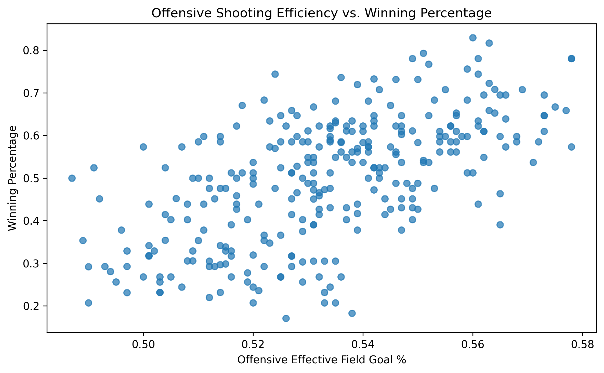
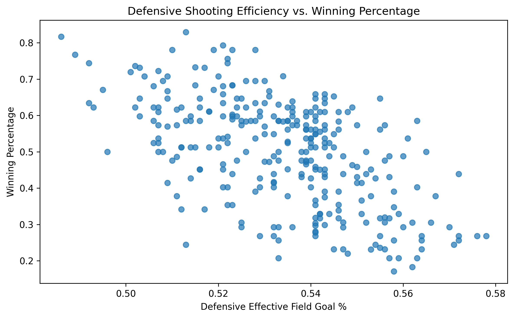
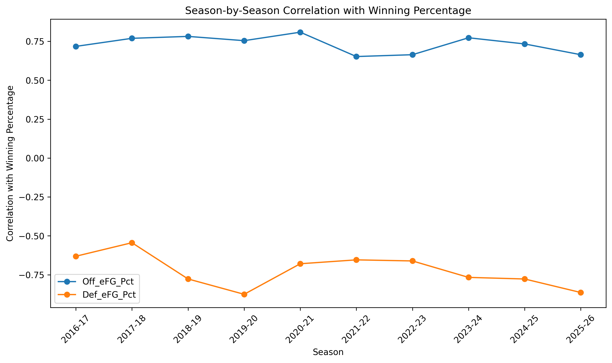
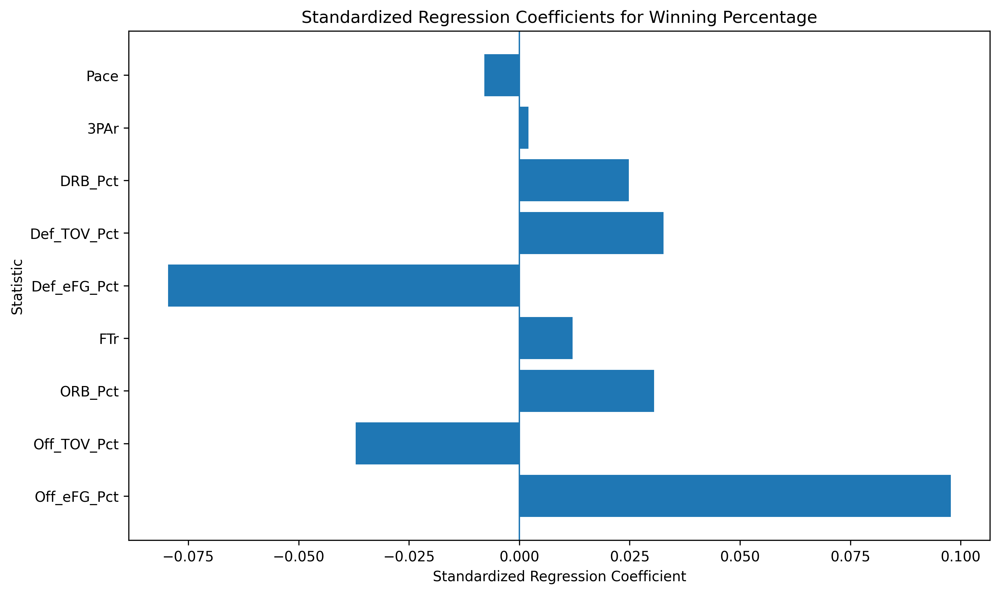

# NBA Team Statistics and Winning Percentage

## Research Question

**What factors are most strongly associated with NBA team success?**

This project analyzes NBA team statistics from the 10 most recent completed NBA seasons, 2016–17 through 2025–26 seasons, to examine which offensive, defensive, and team-style statistics have the strongest relationship with winning percentage.

---

## Dataset

The analysis uses NBA team-level advanced statistics from **Basketball-Reference** covering 10 NBA seasons.

- **Seasons:** 2016–17 through 2025–26
- **Observations:** 300 team-seasons
- **Teams:** 30 NBA teams per season
- **Response variable:** Winning percentage

The main variables analyzed include:

- Offensive effective field goal percentage (Off_eFG%)
- Defensive effective field goal percentage (Def_eFG%)
- Offensive turnover percentage (Off_TOV%)
- Defensive turnover percentage (Def_TOV%)
- Offensive rebound percentage (ORB%)
- Defensive rebound percentage (DRB%)
- Free throw rate (FTr)
- Three-point attempt rate (3PAr)
- Pace

---

## Methodology

### 1. Correlation Analysis

I first calculated the correlation between each team statistic and winning percentage across all 300 team-seasons.
This helped me identify which statistics have the strongest overall linear relationships with winning percentage.

### 2. Multiple Linear Regression

I then used multiple linear regression to examine the relationship between the statistical factors and winning percentage while considering the predictors simultaneously.

The final model included:

- Off_eFG%
- Off_TOV%
- ORB%
- FTr
- Def_eFG%
- Def_TOV%
- DRB%
- 3PAr
- Pace

Win and loss totals were excluded because winning percentage is already calculated from them.
Net rating was also excluded from the final model because it comes from offensive and defensive rating.

### 3. Standardized Regression Coefficients

The predictors were standardized so the regression coefficients could be compared on the same scale.
This helps identify which variables have the strongest unique statistical associations with winning percentage within the regression model.

### 4. Season-by-Season Analysis

I calculated the correlation between each statistic and winning percentage separately for each season.
This was used to examine whether the relationships observed across all 10 seasons were reasonably consistent from season to season.

---

## Key Findings

### Offensive and Defensive Shooting Efficiency

The strongest and most consistent relationships with winning percentage were associated with shooting efficiency.

| Statistic | Overall Correlation | Average Season Correlation | Standardized Coefficient |
|---|---:|---:|---:|
| Off_eFG% | 0.610 | 0.732 | 0.098 |
| Def_eFG% | -0.572 | -0.723 | -0.080 |
| DRB% | 0.292 | 0.371 | 0.025 |
| Off_TOV% | -0.360 | -0.365 | -0.037 |

Offensive effective field goal percentage had a strong positive relationship with winning percentage. Defensive effective field goal percentage had a strong negative relationship which means teams that allowed lower opponent shooting efficiency usually had higher winning percentages. These relationships were also relatively consistent across the 10 individual seasons.

### Other Statistics

Several other statistics showed weaker relationships with winning percentage. Three-point attempt rate had a small positive correlation with winning percentage which suggests that teams that attempted more three-pointers tended to have somewhat higher winning percentages. But, its standardized coefficient in the multiple regression model was very small and not statistically significant which suggests that three-point attempt rate did not have a strong unique association with winning percentage after accounting for the other variables in the model.
Pace also had a relatively small standardized coefficient compared with the shooting-efficiency variables, indicating a weaker association with winning percentage in the multiple regression model.

---

## Regression Results

The final multiple regression model explained approximately **91.8% of the observed variation in winning percentage** across the 300 team-season observations.

**R² = 0.918**

The relatively high R² is reasonable given that the predictors are season-level team statistics that capture important aspects of basketball performance. However, this model measures **same-season associations** rather than predicting future team performance, so the results should not be interpreted as evidence that these statistics cause winning.

The overall regression model was statistically significant. The standardized coefficients showed that offensive and defensive effective field goal percentage had the largest coefficient magnitudes among the predictors included in the model. Standardized coefficients represent each predictor's unique association with winning percentage after accounting for the other variables in the model, so their magnitudes can differ from the simple correlations reported above.

---

## Visualizations

### Offensive Shooting Efficiency vs. Winning Percentage



### Defensive Shooting Efficiency vs. Winning Percentage



### Season-by-Season Correlations



### Standardized Regression Coefficients



---

## Limitations

There are several limitations to this analysis.

1. **Correlation does not imply causation.**  
   The analysis identifies statistical associations but cannot establish that a particular statistic directly causes teams to win more games.

2. **Repeated team observations.**  
   Teams appear in multiple seasons, so the 300 observations are not completely independent of one another.

3. **Limited time period.**  
   The analysis covers 10 recent NBA seasons rather than the entire history of the league.

4. **Observational data.**  
   The analysis does not account for every factor that can influence team success, such as injuries, player availability, roster construction, coaching, or schedule strength.
   For example, the 2019–20 season produced unusual defensive shooting-efficiency patterns compared with other seasons which may reflect the NBA bubble's different circumstances.

---

## Conclusion

Across the 2016–17 through 2025–26 NBA seasons, offensive and defensive shooting efficiency showed the strongest and most consistent relationships with team winning percentage among the statistics examined.
The multiple regression model also found substantial explanatory power, with an R² of 0.918. However, these results describe statistical associations rather than causal effects.
This project demonstrates how correlation analysis, multiple linear regression, standardized coefficients, and season-by-season analysis can be used to investigate factors associated with sports performance.

---

## Tools

- Python
- Pandas
- Statsmodels
- Scikit-learn
- Matplotlib
- Google Colab
- GitHub

---

## Repository Structure

```text
nba-team-stats-analysis/
│
├── data/
│   ├── Games.csv
│   └── bref_team_stats_clean.csv
│
├── analysis/
│   ├── nba_analysis.py
│   │
│   └── models/
│       ├── off_efg_vs_win_pct.png
│       ├── def_efg_vs_win_pct.png
│       ├── season_correlations.png
│       └── standardized_coefficients.png
│
└── README.md
